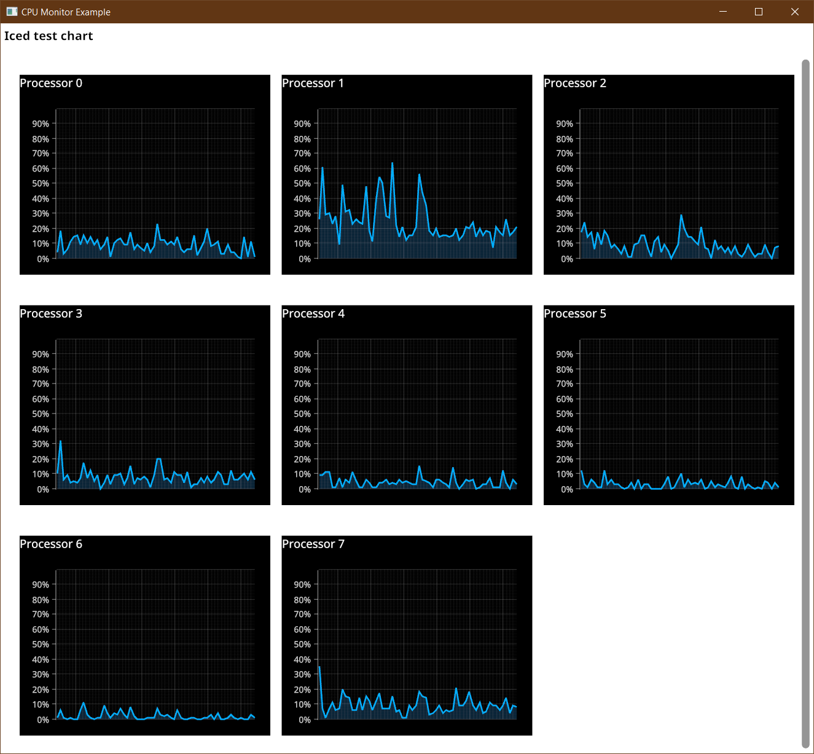
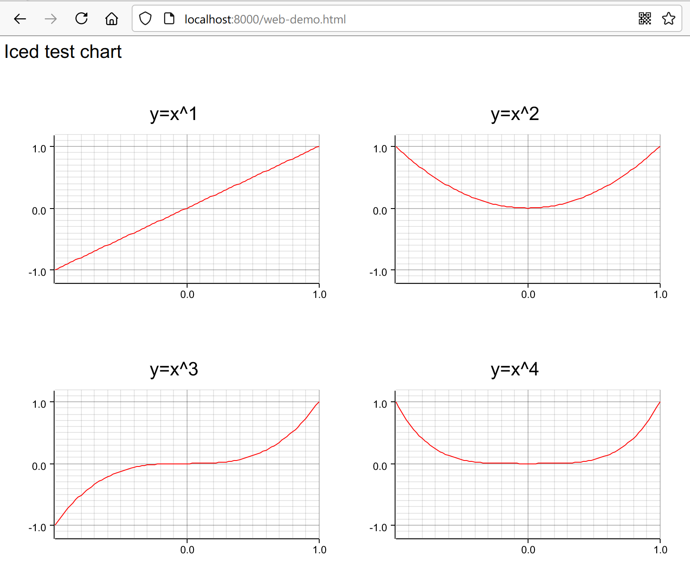

# plotters-iced
[](https://github.com/joylei/plotters-iced/actions?query=workflow%3A%22Test+and+Build%22)
[](https://docs.rs/plotters-iced)
[](https://crates.io/crates/plotters-iced)
[](https://github.com/joylei/plotters-iced/blob/master/LICENSE)

This is an implementation of an Iced backend for Plotters, for both native and wasm applications.

This backend has been optimized as for speed. Note that some specific plotting features supported in the Bitmap backend may not be implemented there, though.

## Showcase





## What is Plotters?

Plotters is an extensible Rust drawing library that can be used to plot data on nice-looking graphs, rendering them through a plotting backend (eg. to a Bitmap image raw buffer, to your GUI backend, to an SVG file, etc.).

**For more details on Plotters, please check the following links:**

- For an introduction of Plotters, see: [Plotters on Crates.io](https://crates.io/crates/plotters);
- Check the main repository on [GitHub](https://github.com/38/plotters);
- You can also visit the Plotters [homepage](https://plotters-rs.github.io/);

## How to install?

Include `plotters-iced` in your `Cargo.toml` dependencies:

```toml
[dependencies]
plotters-iced = "0.1"
iced = { version = "0.3", features = ["canvas", "tokio"] }
plotters="0.3"
```

## How to use?

First, import `Chart` and `ChartWidget`:

```rust
use plotters_iced::{Chart, ChartWidget, DrawingBackend, ChartBuilder};
```

Then, derive `Chart` trait and build your chart, and let `plotters-iced` takes care the rest:

```rust
struct MyChart;
impl Chart<Message> for MyChart {
    fn build_chart<DB:DrawingBackend>(&self, builder: ChartBuilder<DB>) {
        //build your chart here, please refer to plotters for more details
    }
}
```

Finally, render your chart view:

```rust
impl MyChart {
    fn view(&mut self)->Element<Message> {
        ChartWidget::new(self)
            .width(Length::Unit(200))
            .height(Length::Unit(200))
            .into()
    }
}
```

_If you are looking for a full example of an implementation, please check [cpu-monitor.rs](./examples/cpu-monitor.rs)._

## How to run the examples?

### Example #1: `cpu-monitor`

This example samples your CPU load every second, and renders it in a real-time chart:

```sh
cargo run --release --example cpu-monitor
```

From this example, you'll learn:

- how to build charts by `plotters-iced`
- how to feed data to charts
- how to make layouts of charts responsive
- how to use fonts with charts

### Example #2: `split-chart`

This example shows you how to split drawing area.

- Run as native application
```sh
cargo run --release --example split-chart
```

- Run as wasm application

First, install wasm-bindgen-cli v0.2.69 (iced requires this version)
```sh
cargo install -f wasm-bindgen-cli --version 0.2.69
```

Then build the code and generate wasm bindings
```sh
cargo build --example split-chart --target wasm32-unknown-unknown
wasm-bindgen ../target/wasm32-unknown-unknown/debug/examples/split-chart.wasm --out-dir ./examples/js --target web
```

Then, host the `examples` folder with a http server
```sh
cargo install https
http examples
```
visit `http://localhost:8000/web-demo.html` in your browser.


## Are there any limitations?

### Limitation #1: No image rendering

It's not possible without modification of the code until layer is supported by `Iced`.

### Limitation #2: Limited text rendering

Only ttf font family are supported for text rendering, which is a limitation of `Iced`, please look at  [cpu-monitor.rs](./examples/cpu-monitor.rs). As well, font transforms are not supported,which is also a limitation of `Iced`.


## Credits

- [plotters-conrod](https://github.com/valeriansaliou/plotters-conrod)